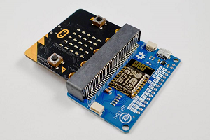

# pxt-wifi
MakeCode extension for [WiFi:bit](https://e-radionica.com/en/wifi-bit.html):
 

 
It's used for connecting to the Internet or local network through WiFi connection. You can send or receive information by using HTTP methods or AT commands. WiFi:bit can also be used as breakout board (edge connector).
 
## Commands
### Connect to WiFi:bit
")
 
Makes a serial connection between micro:bit and WiFi:bit. You should put it in a start block of every WiFi:bit project.
 
### Connect to WiFi network
")
 
Connects WiFi:bit to WiFi network. You should execute it only once. Next time WiFi:bit will connect automatically.
 
### Disconnect from WiFi network
")
 
Disconnects WiFi:bit from WiFi network. You need this command only if you're paranoid. :)
 
### Execute AT command
")
 
Executes AT command. It's for power users, for total control or cases which can't be covered with other commands. [List of AT commands.](https://room-15.github.io/blog/2015/03/26/esp8266-at-command-reference/)
 
### Execute HTTP method
")
 
Main command of this extension. It's used for data sending, changing, deleting and fetching by using some of the [HTTP methods](https://www.tutorialspoint.com/http/http_methods.htm). This is basic form of command. You can expand it with optional parameters (body and headers).
 
### Blynk: write pin value
")
 
Write Blynk pin value. [Blynk](https://blynk.io/) is popular IoT service. This command simplifies its usage with WiFi:bit projects.
 
### Blynk: read pin value
")
 
Read Blynk pin value. [Blynk](https://blynk.io/) is popular IoT service. This command simplifies its usage with WiFi:bit projects.
 
### Newline
")
 
Line separator. It's used in multiline body and headers. You should put it between each pair of lines.
 
### Change HTTP method wait period
")
 
Changes HTTP method wait period. It's for power users and available only in JavaScript part of MakeCode. By defaut HTTP method execution time is cca. 15 seconds. That's OK for almost all networks. If you have good network you can reduce execution time. Default input value is 1000. If you, for example, set it to 500 execution will be twice faster. You can also slow execution by setting a value which is greater than 1000.
 
## Examples
### Connect to the Internet

 
### Send dice value to ThingSpeak

 
### Send some data to Beebotte

 
### Read and write Blynk pin values

 
For explanation of examples and more details, check [official tutorial](https://e-radionica.com/en/blog/using-wifibit-with-the-official-makecode-extension-pxt-wifibit/).
 
 
## License
MIT License
 
 
## Supported targets

* for PXT/microbit
